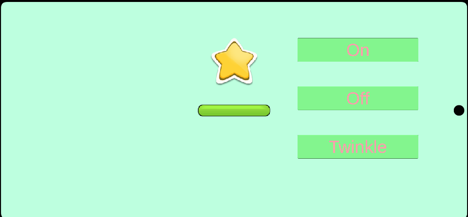
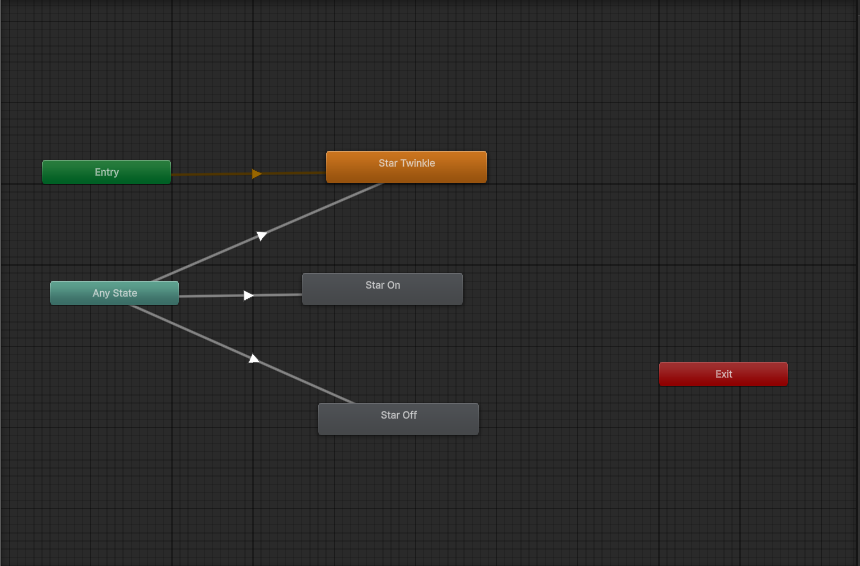

# 🧾 UI FX Demo – 구현 의도 및 제안서 대응 설명

본 프로젝트는 케이엘피(KLP) 채용 메일에 명시된 **UI 연출 데모 과제** 요구사항에 충실히 부합하도록 설계·구현되었습니다.  
요구된 기능적 조건(Animator, 이펙트, DOTween 사용)과 연출 흐름(상태 전환 → 모션/이펙트 연출 → 결과 UI 노출)을 모두 충족하며,  
UI 기반의 경량 구조로 실무 환경에 적합한 퍼포먼스를 보장합니다.

---

## 🎇 UI FX Demo  
📎 [GitHub Repository](https://github.com/OnionKimchi/UI-Fx-Demo)  
🎥 [시연 영상 보기 (Google Drive)](https://drive.google.com/file/d/1TbSaKxb2HxSB6VwKBgHumERa_JOw8CYo/view?usp=sharing)

---

## 📜 요청 조건 요약

> **[주제]**  
> UI 연출 데모 (Animator · 이펙트 · DOTween)  
>   
> **[내용]**  
> 한 씬, 버튼 1개로 “상태 전환 → 모션/이펙트 연출 → 결과 UI 노출” 흐름 1회 (10~30초)  
>   
> **[필수 조건]**  
> - Animator 1회 이상 사용  
> - 이펙트 1개 이상 사용 (3D, 파티클 허용)  
> - DOTween 1회 이상 사용  
> - UI 기반(UGUI) 제작  
> - 에셋 자유 사용 가능  
>   
> **[제출자료]**  
> - 시연 영상 (10~30초)  
> - 구현 설명 + 핵심 코드 (텍스트 또는 PDF)

---

## 🎯 구현 방향 및 대응 전략

### 1️⃣ **요구 흐름 충족: “상태 전환 → 모션/이펙트 → 결과 UI 노출”**
- 버튼 클릭 시 Animator를 통해 **별 오브젝트의 상태 전환(ON/OFF/Twinkle)** 을 표현합니다.  
- 이어서 DOTween을 이용한 **별 이펙트(상승·낙하·회전·페이드)** 연출이 재생되며,  
  클릭에 따른 피드백이 **시각적으로 완결되는 1회 루프형 구조**로 설계되었습니다.  
- 모든 연출은 UI(Canvas) 기반으로 이루어지며, **씬 전환 없이 한 씬 내에서 완결**됩니다.

---

### 2️⃣ **Animator 사용 명확화**

- `StarStateAnimationControll` 스크립트에서 Animator의 트리거(`SetOn`, `SetOff`, `SetTwinkle`)를 호출하여  
  **UI 요소의 상태 전이(State Transition)** 를 구현했습니다.  
- 코드를 통해 직접 애니메이션 타이밍을 조정하지 않고,  
  Animator Controller를 활용해 **시각 연출의 자연스러움과 유지보수성**을 확보했습니다.

---

### 3️⃣ **DOTween 활용**
- `UIStarFXManager` 내에서 DOTween Sequence를 사용하여  
  **별의 상승 → 낙하 → 회전 → 페이드 아웃** 과정을 트윈 애니메이션으로 구성했습니다.  
- `Ease.OutQuad`, `Ease.InQuad` 이징 조합으로 물리적으로 자연스러운 중력감을 표현했고,  
  여러 트윈을 `Join()`으로 병합하여 **하나의 자연스러운 연출 시퀀스**를 구성했습니다.

---

### 4️⃣ **이펙트 구현 및 최적화**
- 실제 별 오브젝트를 UI 상에서 스크린 좌표 변환을 거쳐 발사하는 방식으로 구현했습니다.  
  (RectTransformUtility.WorldToScreenPoint → LocalPoint 변환)  
- 별 오브젝트들은 **오브젝트 풀(List<RectTransform>)** 로 관리되어,  
  Instantiate 없이 `SetActive(true/false)`로만 활성화·비활성화를 반복합니다.  
- 이를 통해 **메모리 할당 최소화**, **GC 스파이크 방지**, **UI 반응속도 향상**을 달성했습니다.

---

### 5️⃣ **버튼 이벤트 처리 구조**
- Unity의 `Button.onClick` 이벤트는 인스펙터에서 매개변수를 직접 전달할 수 없으므로,  
  `StarSpawnOnClick` 스크립트에서 `AddListener()` 방식으로 런타임에 이벤트를 등록했습니다.  
- 이를 통해 클릭된 버튼의 `RectTransform` 정보를 직접 참조하여  
  **해당 UI 요소 중심에서 별 이펙트를 재생**하도록 구현했습니다.  
- 결과적으로 **인스펙터 설정 없이도 자동으로 작동하는 구조**를 갖습니다.

---

## ⚙️ 기술 요약

| 항목 | 구현 요소 | 기술 의도 |
|------|-------------|-----------|
| **Animator** | `StarStateAnimationControll` | 별 상태 전환 및 시각적 반응 구현 |
| **이펙트** | `UIStarFXManager` | 별 발사 및 페이드 아웃 연출 |
| **DOTween** | DOTween Sequence | 복합 애니메이션(이동·회전·페이드) 구성 |
| **UI 기반 구조** | Canvas + RectTransform | 모든 연출이 UGUI 상에서 일관되게 작동 |
| **오브젝트 풀링** | SetActive 재사용 | 성능 최적화 및 메모리 관리 |
| **이벤트 처리** | Button.AddListener() | 런타임 이벤트 연결로 유지보수성 강화 |

---

## 🧩 결론
본 UI FX Demo는 케이엘피의 **UI 연출 데모 과제 요구사항을 정확히 충족**하며,  
Animator, DOTween, 이펙트, UI 시스템을 모두 실무적으로 결합한 구조입니다.  

- **Animator**로 상태 변화를,  
- **DOTween**으로 시각적 움직임을,  
- **오브젝트 풀링**으로 성능을,  
- **Button AddListener**로 런타임 유연성을 확보했습니다.  

> 🎯 **핵심 메시지:**  
> “하나의 클릭이 상태 변화, 모션, 이펙트로 이어지는 완결된 UI 연출 흐름.”  
>  
> 이 프로젝트는 과제 요구조건을 실무 수준으로 해석하여,  
> **퍼포먼스·가독성·재사용성**을 동시에 충족시키는 방향으로 구현되었습니다.
